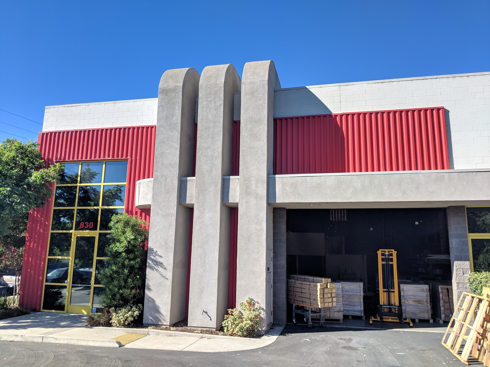

* toc
{:toc}

The FarmBot warehouse is where we store and ship all FarmBot kits and individual parts from. Our lease in this space began on July 1st, 2018.

_Outside the warehouse_

_Inside the warehouse when empty_

_Inside the warehouse when full_

_Receiving goods_

<meta name="theme-color" content="#434343">

# What's next?

 * [Inventory](warehouse/inventory.md)
 * [Order Fulfillment](warehouse/order-fulfillment.md)
 * [Warehouse Supplies and Equipment](warehouse/warehouse-supplies-and-equipment.md)
