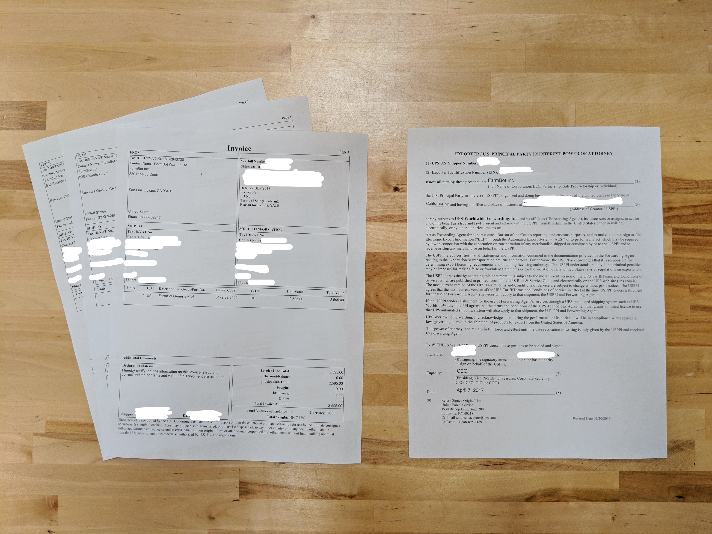

* toc
{:toc}

# Full kits

# Other orders
As we have grown our customer base, the number of people who are ordering replacement parts, upgrade kits, and individual parts to expand upon their FarmBot is increasing.

While the vast majority of our revenue will always be from full kits, we do expect the number of orders without a full kit to eclipse the number of orders for full kits, particularly as our install base expands.

# Shipping
We currently handle shipping label creation with Shipstation. Shipstation imports orders from Shopify and allows for bulk postage purchasing, label creation, and the printing of commercial invoices for international shipments. Once a shipping label has been created, the tracking number is sent from Shipstation back to Shopify, the order is marked as fulfilled, and an email with the tracking link is sent to the customer.

{%
include callout.html
type="info"
title="Multi-package shipments for single items are unsupported in Shopify"
content="The main reason we use Shipstation instead of Shopify's built-in label creation workflow is because each FarmBot kit is shipped in two packages. While Shopify *can* handle multiple fulfillments per order (some products sent in one package, remaining products sent in a second package), it cannot handle multi-package shipments for fulfilling a single item. Bummer.

As soon as Shopify adds this feature, we will likely end our subscription with Shipstation and use Shopify's built-in workflows."
%}

## Carriers
We currently use the following carriers and services based on the shipment type:

|Shipment Type                 |Carrier                       |Service                       |
|------------------------------|------------------------------|------------------------------|
|Domestic order under 1lb      |USPS                          |First Class Package
|Domestic order over 1lb       |UPS                           |Ground
|Domestic FarmBot kit          |UPS                           |Ground
|International order under 1lb |USPS                          |First Class Package International
|International order over 1lb  |UPS                           |Worldwide Expedited
|International FarmBot kit     |UPS                           |Worldwide Expedited

## Customs documentation
Customs information must be included with all international shipments.

### USPS international shipments
For international shipments sent via USPS, customs information is included on the shipping label itself.

### UPS international shipments
International shipments sent via UPS require three signed copies of the **commercial invoice** and one signed **UPS power of attorney (POA)**. The commercial invoices can be printed from Shipstation and must be signed and dated after printing. The power of attorney form can be found in the team Google Drive folder. It has already been digitally signed and dated and can be printed in bulk ahead of time and added to any international shipment's documentation pouch.

_Commercial invoices and UPS POA_

All documents must be inserted into a sealable plastic pouch placed on the outside of the package.



_Customs documents_



# Post-shipping support
## Domestic shipments
Nearly all domestic shipments reach the customer within 1 week without issues. Problems that may arise include:
* Customer has changed addresses since placing the order and needs the shipment to be re-routed. A phone call to UPS can sometimes be made prior to delivery.
* Customer provided an incorrect or outdated shipping address during checkout and must recover the package on their own.

International shipments can take anywhere from 1 week to 2 months depending on the receiving country's import process and how quickly the customer provides information required for the import and pays any taxes.

10-15% of international shipments will result in phone calls and emails to us from UPS asking for additional contact information for the customer. We provide the customer's email address and phone number when available.

<meta name="theme-color" content="#434343">

