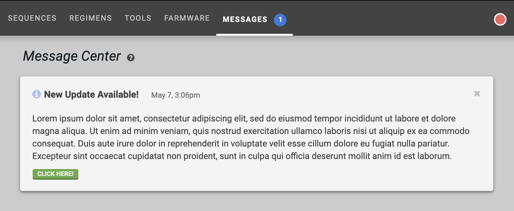

* toc
{:toc}

The FarmBot API supports the creation of `Alert` records. When created, the alert will propagate to the **Message Center** of all users who have logged in within the last 7 months. This is especially useful when creating system-wide announcements, such as end-of-life dates and changelog updates.



_An example alert_

# Creating an alert

Run the following command:

```
$ heroku run rake broadcast:to_all --app=farmbot-staging
```

Then fill in the following information. Fields that are preceded by `(optional)` may be skipped via the `enter` key.

```
=== (optional) Enter `type`
info
=== (optional) Enter href
http://farm.bot
=== (optional) Enter href label
This is the href label
=== Enter title
This is the alert title
=== Enter content
This is the alert's content.
You can have multiple lines of alert content.
When you are done typing in content, just type three “at symbols” on a new line.
The button below links to the href.
```

When you are done entering content, just type three `@` symbols on a new line:

```
@@@
```

The above information will yield the following alert in the message center, with the button linking to [http://farm.bot](http://farm.bot).


# Alert types
The following alert `type`s are available, which will determine what icon is shown in the top-left of the message.
  * `info` - <i class="fa fa-info-circle"></i>
  * `success` - <i class="fa fa-check-square"></i>
  * `warn` - <i class="fa fa-exclamation-triangle"></i>

# Important information

Creating an Alert could take a significant amount of time to finish due to the nature of the auto sync system. Consider increasing the dyno count of the server if this is a concern.

<style>
.hub-container {
  max-width: 1350px;
}
.value-icon {
  display: inline-block;
  height: 18px;
  margin-bottom: -2px;
}
  
a[title="Guides"] {
  color: #f4f4f4!important;
  border-bottom: 5px solid #f4f4f4;
  padding-bottom: 20px!important;
}
  
a[title="Guides"]:hover {
  color: white!important;
  border-bottom-color: white;
}
  
#hub-header li a:hover {
  box-shadow: none!important;
}
</style>

<meta name="theme-color" content="#434343">

