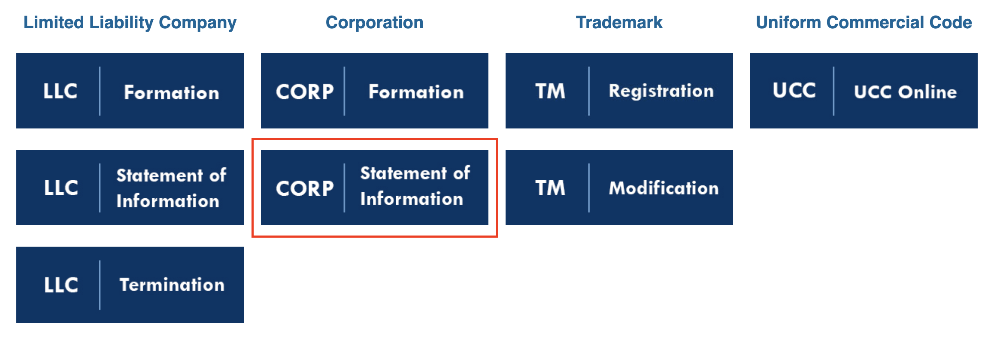
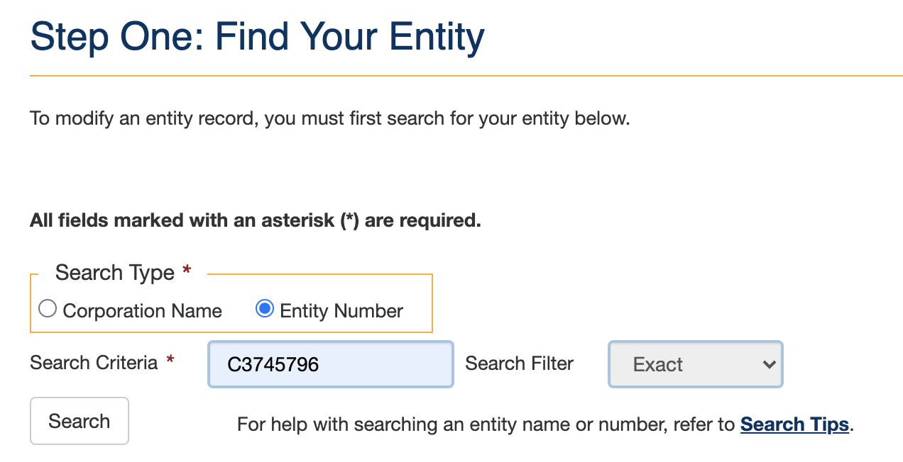
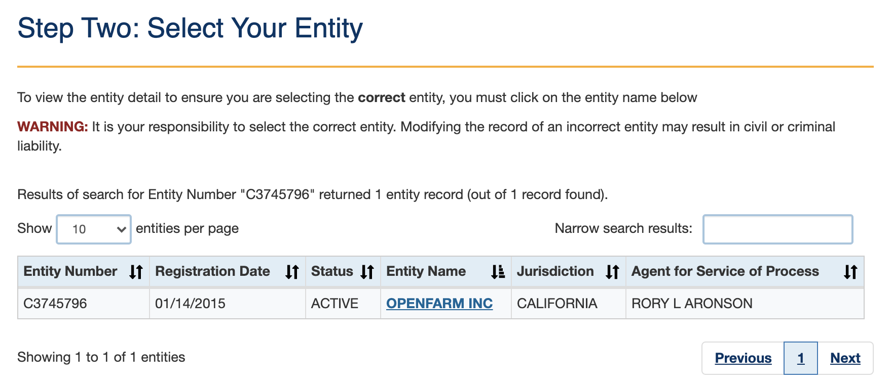

* toc
{:toc}

Once per year, a **Statement of Information** must be filed with the California Secretary of State for OpenFarm Inc. The state will send a **Reminder Notice Postcard** in the mail when it is time to file. When the postcard is received, complete the filing using the instructions below.

# Step 1: Go to the website

Navigate to the website indicated on the postcard; most recently: [bizfile.sos.ca.gov](http://bizfile.sos.ca.gov). Select **File Online**.

Then select to file a **Corporation Statement of Information**. (Even though OpenFarm is a non-profit, the legal entity is a `corporation`)

# Step 2: Fill out the form

Search for **OpenFarm Inc** using the corporate number `C3745796`.

Select the corporation.

Fill out the form fields.

- OpenFarm's registered agent is **LEGALINC REGISTERED AGENTS, INC.** `(C4249296)`.
- Rory Aronson is the acting board member.

Pay for the filing using the OpenFarm debit card.

# Step 3: Archive records

Save the filing confirmation as a PDF named `2020 OpenFarm Statement of Information (Form SI-100)` and upload to the **OpenFarm > Corporate > OpenFarm Statement of Information (Form SI-100)** folder in Google Drive.

