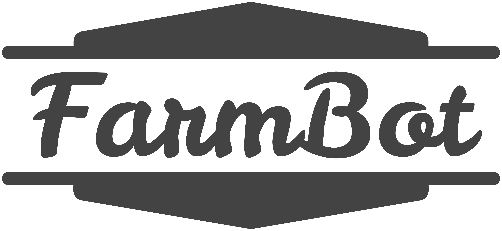

* toc
{:toc}

{%
include callout.html
type="info"
title="Attribution is required"
content="Our media kit content is licensed [CC-BY-NC](https://creativecommons.org/licenses/by-nc/4.0/). This means you must make **proper attribution** to \"FarmBot\", \"FarmBot Inc\", any of our social media usernames, and/or our website, \"https://farm.bot\", when using any of the content. Furthermore, **commercial usage is forbidden**.

See our [licensing page](../FarmBot-Inc/intro/licensing.md#non-functional-works) for additional details about our non-functional works."
%}

# Photos
[Click here for an album of high quality photos](https://photos.app.goo.gl/fD3Td131P6MYYu4c8).

# Videos
Please see our [YouTube channel](http://youtube.farm.bot). If you would like raw footage, please email rory@farm.bot with your request.

# Logos
Right-click to save to your computer. Please do not manipulate the logos.

_Dark gray FarmBot logo, for use on light backgrounds_

_Off-white FarmBot logo, for use on dark backgrounds_

_FarmBot profile image, for use in profile images. May be cropped into a circle._

