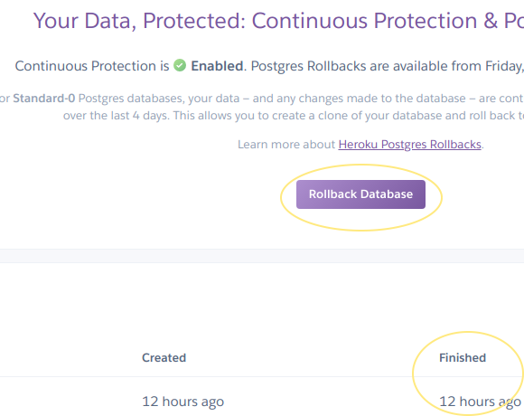

Staging and production environments vary slightly in how they are backed up and rolled back.

# Staging environments

Staging databases use Heroku's [hobby tier database](https://devcenter.heroku.com/articles/heroku-postgres-plans#hobby-tier).

Database rollbacks on staging environments work as follows:

```
➜  api git:(staging) ✗ heroku pg:backups --app XYZ
=== Backups
ID    Created at                 Status                               Size    Database
────  ─────────────────────────  ───────────────────────────────────  ──────  ────────
abc0  2001-01-01 01:01:01 +0000  Completed 2001-01-01 01:01:01 +0000  1.23MB  DATABASE
➜  api git:(staging) ✗ heroku pg:backups:restore abc0 --app my-staging-env
➜  api git:(staging) ✗ heroku ps:restart --app=my-staging-env
```

# Production environments

Production environments differ from staging because they use a [standard tier database](https://devcenter.heroku.com/articles/heroku-postgres-plans#standard-tier).

Please see the photo below and the [Heroku documentation](https://devcenter.heroku.com/articles/heroku-postgres-rollback) for more information.




