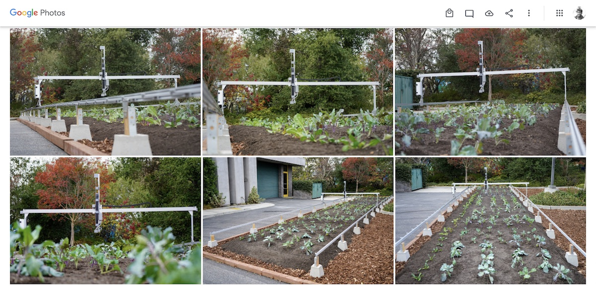
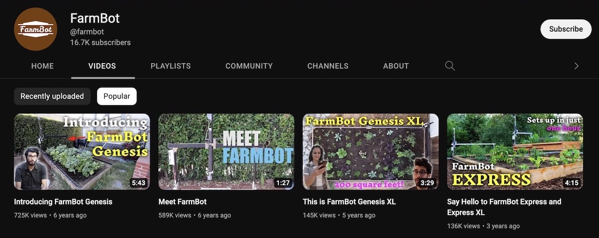

FarmBot is an exciting subject for **journalists**, **podcasters**, **YouTubers**, and more to cover. FarmBot is not only new technology that is still _unheard of by many_, it combines unique aspects not typically discussed in the technology, IoT, home automation, or agricultural sectors.

For example, [FarmBot is 100% open-source](https://farm.bot/pages/open-source), meaning all of the 3D CAD models, electronics schematics, and even the software source code is given away _for free_ to empower end-users to make modifications, repairs, and truly own their tech. This stands in stark contrast with most conventional agriculture companies who relentlessly patent their hardware, software, data, genetics, and more.

Depending on your audience, you may wish to focus on one of the myriad ways FarmBot is used:

- **At home** for self sufficiency, food sovereignty, sustainability, health, home automation.
- **At K-12 schools** as a teaching tool for robotics, engineering, agriculture, nutrition, biology.
- **At universities** as a research tool for growing methods, genetics, inputs, climate science.
- **Other uses** such as restoration, serving people with disabilities, industrial automation.



# Using our media kit

We encourage you to use any of the resources on this page or from our other websites when writing about FarmBot or sharing our work in videos, podcasts, etc. **Please just don't use any of our media without giving us credit.**



# Photos

Please see [this album of high quality photos](https://photos.app.goo.gl/fD3Td131P6MYYu4c8) for use in your coverage and/or promotional materials. Photos in the album include:

- Installed FarmBots **growing gardens**
- Detailed product shots of **FarmBot hardware**
- Photos of **customer installations** from the [FarmBot forum](https://forum.farmbot.org/) and other sources

{%
include callout.html
type="hashtag"
content="Looking for more images? Search **#FarmBot** on [Instagram](https://www.instagram.com/explore/tags/farmbot/), [Twitter](https://twitter.com/search?q=%23farmbot), or other platforms."
%}

# Videos

Please see our [YouTube channel](https://www.youtube.com/@farmbot/videos) for our complete library of **embeddable videos**. Select videos may be **downloaded** in full quality from the links below for remixing into your own media.



**Product launches**

- [Introducing FarmBot Genesis](https://drive.google.com/file/d/1QCKZWJ694CL82SiLgKXCBM9Md18lgxte/view)
- [This is FarmBot Genesis XL](https://drive.google.com/file/d/129Io-ez5PYkR7WwEp42wuZRlXjYcMnSJ/view)
- [Say Hello to FarmBot Express](https://drive.google.com/file/d/1cdF0j0R3KbKAZmjgzZ1hETzQuZCzWHlj/view)
- [It's time for FarmBot Express and Genesis MAX](https://drive.google.com/file/d/1rYObpGVCquSY67iAKZtYKCsRosZdgpJi/view)

**FarmBot stories**

- [Take Back Control](https://drive.google.com/file/d/1Y44H3GaTXGISxQuegb3KMxZxehkkdEcF/view)
- [Inspiring the Next Generation of Farmers](https://drive.google.com/file/d/1fyLwq-Lf9HijpEiBjAedo1gGkKhOfXX5/view)
- [FarmBot at Home](https://drive.google.com/file/d/1-kC8-jqkpBgJ6seJ4C3yiS5TmV1FheG1/view)
- [Brainstorming Innovative Open-Source Approaches to Food Production with NASA](https://drive.google.com/file/d/1mwoPHxVv9zzZQRMf6hgs63aizoFDrJks/view)
- [FarmBot as an Accessibility Technology](https://drive.google.com/file/d/1DBgPcS1zlnHRu0Qf60e83cZag7mC9B8c/view)
- [FarmBot in Education](https://drive.google.com/file/d/1UboyWw2SBK6eIiqR8g1afM0W2Ik7abD7/view)
- [FarmBot Digital Twin](https://drive.google.com/file/d/16qE0eubFPg40NG7h6rXYUZ0rewdbABJM/view)
- [FarmBot Gripper Tool - A Student Project from Curio](https://drive.google.com/file/d/1U3LZZHMEvoERQm0emAh78Rr8KOlkz6bg/view)
- [Welcome to FarmBot HQ](https://drive.google.com/file/d/18HsnK_ayHYYCGfM5EqwkZJ5g5e9SLzqJ/view)

**Product info**

- [Rotary Tool](https://drive.google.com/file/d/1m_Mg8OCBMBoEJaFlyMk__mh12ax7n_-I/view)
- [FarmBot Genesis v1.6 Unboxing](https://drive.google.com/file/d/1-3bNeChe0-QC7kwtCA_dMAMoR86WwR41/view)
- [FarmBot Express v1.1 Unboxing and Assembly](https://drive.google.com/file/d/1SqbUSt1lmWEEiPDFoTORqNpMPIXxGrSd/view)

# Logos

Right-click to save to your computer.



**With background**



**Without background**



# Past publications

**2023**

- USA Today - [Department of Agriculture Special Edition](https://usatodayspecial-va.newsmemory.com/?special=Department+of+Agriculture&date=20230318)

**2022**

- Market Watch – [Fight food inflation with a robot farmer that does most of the work for you](https://www.marketwatch.com/story/fight-food-inflation-with-a-robot-farmer-that-does-most-of-the-work-for-you-11668436842)
- Heise – [Farmbot mit automatischem Händchen](https://www.heise.de/news/Farmbot-mit-automatischem-Haendchen-6653844.html)
- El Nuevo Dia – [Así funciona el sistema automatizado FarmBot que desarrolla Engine-4](https://www.elnuevodia.com/tecnologia/otros/videos/asi-funciona-el-sistema-automatizado-farmbot-que-desarrolla-engine-4-279379/)

**2021**

- CNN – [Tech for Good](https://www.youtube.com/watch?v=nai1JNIGnes)
- Netflix – [Ada Twist, Scientist](https://www.youtube.com/watch?v=0M3sfjTGkkM)
- Heise – [c't-FarmBot: Erste Ernte mit dem Gartenroboter](https://www.heise.de/news/c-t-FarmBot-Erste-Ernte-mit-dem-Gartenroboter-6052185.html)
- Heise – [Smart-Garden-Erfahrungsbericht: Ein Jahr gärtnern mit dem FarmBot](https://www.heise.de/tests/Smart-Garden-Erfahrungsbericht-Ein-Jahr-gaertnern-mit-dem-FarmBot-6279205.html)
- Heise – [Automatischer Gärtner: Einen Hochbeet-FarmBot bauen](https://www.heise.de/ratgeber/Anleitung-Einen-FarmBot-als-Bastelprojekt-zusammenbauen-6008238.html)
- Kirsten Dirksen – [Made FarmBot home-kit. Now helps NASA on farming](https://www.youtube.com/watch?v=2dRpmuU2ZrU)

**2020**

- Business Insider – [FarmBot automates tending, weeding, and watering a garden and makes it as easy as playing a video game to feed a family of 4 — here's how it works](https://www.businessinsider.com/farmbot-automated-farm-kits-controlled-through-app-2020-6)
- Venture Beat – [UC Berkeley robotics lab wants to fully automate a polyculture garden](https://venturebeat.com/ai/uc-berkeley-robotics-lab-wants-to-fully-automate-a-polyculture-garden/)
- Al Jazeera – [QITCOM 2019 Interview](https://www.youtube.com/watch?v=BPuOhfJzEQY)

**2019**

- Freethink – ["Collaborative" Robots Are Taking Our Jobs, But It Might Be a Good Thing](https://www.youtube.com/watch?v=-jeSitHw-lk)
- The Spoon – [FarmBot Launches Two New Robotics Kits to Give Anyone an (Automated) Green Thumb](https://thespoon.tech/farmbot-launches-two-new-robotics-kits-to-give-anyone-a-automated-green-thumb/)
- Hackaday – [FarmBot Unveils New CNC Gardening Robot Models](https://hackaday.com/2019/07/01/farmbot-unveils-new-cnc-gardening-robot-models/)

**2017**

- Make: Magazine – [Edible Innovations: FarmBot Helps Automate Small-Scale Food Production](https://makezine.com/article/home/gardening/community-creating-solution-farmbot-technology/)
- The Henry Ford’s Innovation Nation – [Season 3 Episode 66: FarmBot](https://www.youtube.com/watch?v=1-CpHBEP2Wc)
- Tharawat Magazine – [Farmbot: A Do-it-yourself Open Source Farming Robot](https://www.tharawat-magazine.com/start/farmbot-open-source-farming-robot/)

**2016**

- The New York Times – [Commercial Kitchens Getting a Taste of 3-D-Printed Food](https://www.nytimes.com/2016/10/24/business/commercial-kitchens-getting-a-taste-of-3-d-printed-food.html)
- VICE – [This Engineer Created a Real-Life Version of Farmville](https://www.vice.com/en/article/9a8383/this-engineer-created-a-real-life-version-of-farmville)
- The Verge – [I bet Mesopotamian farmers didn’t see FarmBot coming](https://www.theverge.com/circuitbreaker/2016/6/8/11887402/farmbot-farming-robot-agriculture-garden-automated)
- Smithsonian Magazine – [The FarmBot Genesis Brings Precision Agriculture to Your Own Backyard](https://www.smithsonianmag.com/innovation/farmbot-genesis-brings-precision-agriculture-your-own-backyard-180959603/)
- Huff Post – [AgBots Are Taking Over Farms And They're Awesome](https://www.huffpost.com/archive/au/entry/argobots-are-taking-over-farms-and-theyre-awesome_au_5cd41861e4b0ca9b77563a0b)
- Inhabitat – [FarmBot Genesis seeds, waters, and fertilizes your garden with life-giving precision](https://inhabitat.com/farmbot-genesis-seeds-waters-and-fertilizes-your-garden-with-life-giving-precision/)
- Modern Farmer - [The FarmBot Genesis Brings Precision Agriculture To Your Own Backyard](https://modernfarmer.com/2016/06/farmbot-genesis/)
- Engadget – [FarmBot: Gemüseanbau per App-Steuerung](https://www.engadget.com/de-2016-06-09-farmbot-gemuseanbau-per-app-steuerung.html)
- AgFunder – [Open Source Tech and Encouraging Consumers to Farm](https://agfundernews.com/farmbot-founder-aronson-on-open-source-tech-and-encouraging-consumers-to-farm5832)
- Arduino – [FarmBot is an open-source CNC farming machine](https://blog.arduino.cc/2016/06/07/farmbot-is-an-open-source-cnc-farming-machine/)
- Digital Trends – [FarmBot DIY agriculture robot promises to usher in the future of farming](https://www.digitaltrends.com/cool-tech/farmbot-open-source-agriculture-robot/)
- All About Circuits – [FarmBot Intends to Revolutionize Home Gardening](https://www.allaboutcircuits.com/news/farmbot-intends-to-revolutionize-home-gardening/)
- Tech Insider – [This robot will grow all the food you need in your backyard](https://www.businessinsider.com/farming-robot-farmbot-automatically-grow-vegetables-backyard-garden-2016-7)
- Hacker News - [FarmBot – Open-Source CNC Farming](https://news.ycombinator.com/item?id=11856915)
- Yahoo News – [The Latest in At-Home Gardening Technology: The FarmBot](https://sg.news.yahoo.com/latest-home-gardening-technology-farmbot-223741146.html)
- Yahoo News – [This Robot Makes Gardening Like a Game of 'Farmville'](https://finance.yahoo.com/news/robot-makes-gardening-game-farmville-161140546.html)
- Kirsten Dirksen – [FarmBot: open-source backyard robot for automated gardening](https://www.youtube.com/watch?v=BqYrAWssrrY)

**2015**

- Fast Company – [6 Downloadable Food Machines For The Urban Homesteader To Make On Their Own](https://www.fastcompany.com/3042975/6-downloadable-food-machines-for-the-urban-homesteader-to-make-on-their-own)
- Digital Trends – [Like Roombas for your garden, Farmbot Genesis automates home farming](https://www.digitaltrends.com/home/farmbot-diy-agriculture-gardening-robot/)
- Singularity Hub – [How a Robot in the Garden Might Save a Trip to Whole Foods](https://singularityhub.com/2015/12/15/how-a-robot-in-the-garden-might-replace-a-trip-to-whole-foods/)
- Open Electronics – [FarmBot the Open Source Farming CNC Robot](https://www.open-electronics.org/farmbot-the-open-source-farming-cnc-robot/)
- Adafruit – [Farmbots Makes Growing Food Easier](https://blog.adafruit.com/2015/12/29/farmbots-makes-growing-food-easier-arduino/)

**2014**

- WIRED – [This Farmbot Makes Growing Food as Easy as Playing Farmville](https://www.wired.com/2014/02/farmbot/)
- TEDxUCLA – [Open-source automated precision farming](https://www.youtube.com/watch?v=9CJt4MFn22M)
- MOTHERBOARD – [FarmBot Will 3D Print Your Crops and Email You When It Harvests Them](https://www.vice.com/en/article/3dkaxw/in-the-middle-of-3d-printing-robots-and-agriculture-sits-farmbot)
- Opensource.com – [The next open source frontier is the farm](https://opensource.com/business/14/9/farming-new-field-open-source)
- 3Dprint.com – [FarmBot: An Open Source 3D Farming Printer That Aims to Create Food For Everyone](https://3dprint.com/12325/farmbot-3d-farming-printer/)

**2013**

- Open Electronics – [FarmBot: open-source, scalable, automated precision Farming Machines](http://www.open-electronics.org/farmbot-open-source-scalable-automated-precision-farming-machines/)