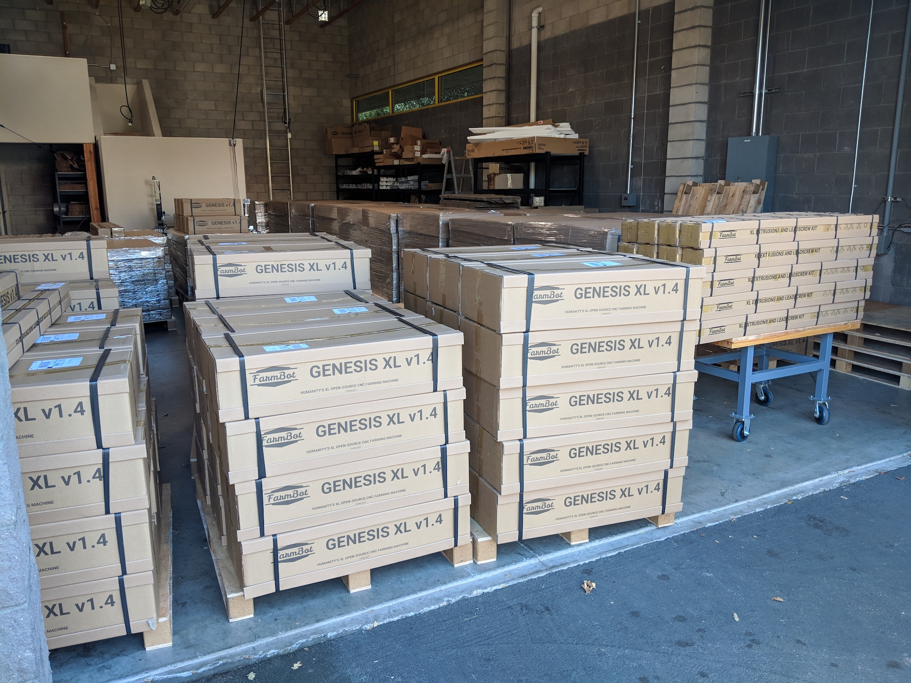

The **FarmBot warehouse** is where we store and ship all FarmBot kits and individual parts from. Our lease in this space began on July 1st, 2018.



# Capacity

The current configuration of the warehouse has capacity to store 30 pallets in racks and approximately 20 additional pallets out of racks.

|FarmBot          |Max # of Kits|
|-----------------|-------------|
|Express v1.1     |900          |
|Express XL v1.1  |900          |
|Genesis v1.6     |700          |
|Genesis XL v1.6  |700          |

# Rent history

|Dates                      |Rent         |Notes                      |
|---------------------------|-------------|---------------------------|
|July 2018 - February 2020  |$4,550/month |                           |
|March 2020 - April 2020    |$1,450/month |Covid relief               |
|May 2020                   |$4,190       |Maintenance reconciliation |
|May 2020 - July 2020       |$4,650/month |                           |
|August 2020 - October 2020 |$0/month     |Covid relief               |
|November 2020 - June 2021  |$4,750/month |                           |
|June 2021                  |$3,059       |Maintenance reconciliation |
|July 2021 - May 2022       |$4,850/month |                           |
|May 2022                   |$1,481       |Maintenance reconciliation |
|June 2022 - May 2023       |$4,950/month |                           |
|May 2023                   |$2,576       |Maintenance reconciliation |
|June 2023 - May 2024       |$5,050/month |                           |

# What's next?

 * [Inventory](warehouse/inventory.md)
 * [Shipping](warehouse/shipping.md)
 * [Warehouse Supplies and Equipment](warehouse/warehouse-supplies-and-equipment.md)
