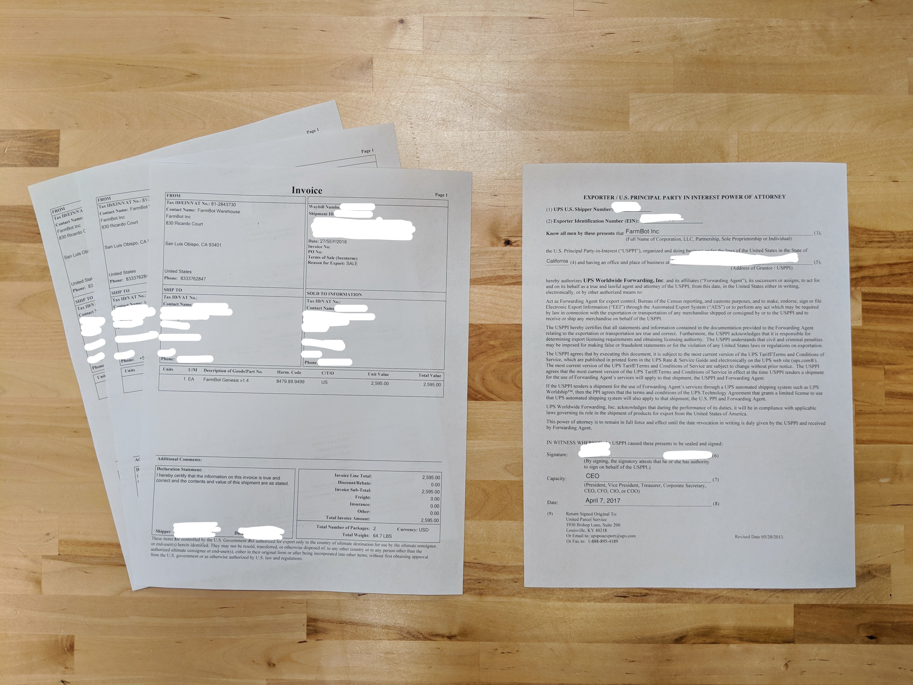

**Shipping** is completed approximately once per week, usually on a Thursday or Friday. A pickup request must be scheduled the day prior with the carrier we are using at the time (FedEx or UPS). The truck usually arrives around 3PM, though they may arrive anytime between 1PM and 6PM, so full FarmBot kits and other large orders (over 1lb) must be ready by 1PM. Small packages (less than 1lb) are shipped via USPS and can be dropped off at the post office at any time.

# Creating labels

We currently handle shipping label creation with **Shipstation**. Shipstation imports orders from Shopify and allows for bulk postage purchasing, label creation, and the printing of commercial invoices for international shipments. Labels are printed on standard 4" x 6" thermal labels using a Rollo brand printer.

Once a shipping label has been created, the tracking number is sent from Shipstation back to Shopify, the order is marked as fulfilled, and an email with the tracking link is sent to the customer.

{%
include callout.html
type="info"
title="Multi-package shipments for single items are unsupported in Shopify"
content="The main reason we use Shipstation instead of Shopify's built-in label creation workflow is because FarmBot Genesis and Genesis XL kits are shipped in two packages. While Shopify *can* handle multiple fulfillments per order (some products sent in one package, remaining products sent in a second package), it cannot handle multi-package shipments for fulfilling a single item. Bummer.

As soon as Shopify adds this feature, we will likely end our subscription with Shipstation and use Shopify's built-in workflows."
%}

# Carriers

We currently use the following carriers and services based on the shipment type:

|Shipment Type                 |Carrier                       |Service                       |
|------------------------------|------------------------------|------------------------------|
|Domestic FarmBot kit          |UPS FedEx                  |Ground Ground
|Domestic (over 1lb)           |UPS FedEx                  |Ground Ground
|Domestic (under 1lb)          |USPS                          |First Class
|International FarmBot kit     |UPS FedEx                  |Worldwide Expedited International Economy
|International (over 1lb)      |UPS FedEx                  |Worldwide Expedited International Economy
|International (under 1lb)     |USPS GlobalPost            |First Class International Economy Intl

# Customs documentation

For all shipments sent via USPS or GlobalPost, customs information is included on the shipping label itself.

For shipments to _most countries_ via UPS or FedEx, customs information is automatically electronically submitted as denoted on the shipping label by `EDI` (Electronic Data Interchange) for UPS shipments or `ETD` (Electronic Trade Documents) for FedEx shipments.

If the destination country does not accept electronic trade documents then Shipstation will automatically generate and print **air waybill labels** in addition to the standard shipping labels. When this happens, three copies of the **commercial invoice** must be printed manually on 8.5" x 11" paper from Shipstation and signed and dated.

The commercial invoices, air waybill labels, and occasionally a **certificate of origin** can then be placed in a documentation pouch affixed to the package.

Sometimes a **power of attorney form** is also necessary, which can be found in the team Google Drive folder. It has already been digitally signed and dated and can be printed ahead of time and added to any international shipment's documentation pouch.





# Post-shipping support

Nearly all domestic shipments reach the customer within 1 week without issues. International shipments can take anywhere from 1 week to 2 months depending on the receiving country's import process and how quickly the customer provides information and pays any taxes required for the import.

Problems that may arise from a shipment include:

* Customer has changed addresses since placing the order and needs the shipment to be re-routed. This can occur more often with pre-orders. Call UPS or FedEx to arrange a change of address.
* Customer provided an incorrect or old shipping address during checkout. They must recover the package on their own.
* Customer is going on vacation or is otherwise unavailable to receive the package and needs the delivery to be delayed. Call UPS or FedEx to arrange a hold.
* About 5% of international shipments will result in phone calls and emails to us from UPS or FedEx asking for additional contact information for the customer. We can provide the customer's email address and phone number when available in Shopify.
