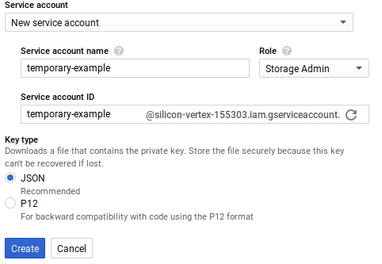
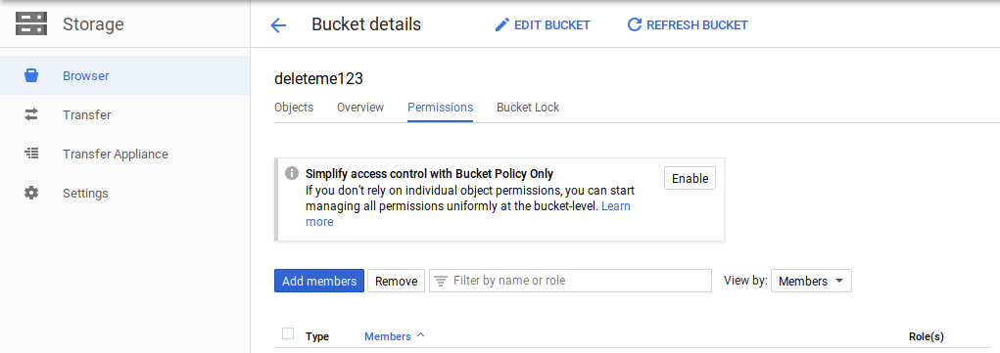

We host the app on Heroku. This means that we [can't store the files to disk](https://help.heroku.com/K1PPS2WM/why-are-my-file-uploads-missing-deleted) and [it's a bad idea to upload the images directly to a Heroku-based process](https://devcenter.heroku.com/articles/request-timeout#uploading-large-files).

Instead of uploading directly to the API, devices upload images to **Google Cloud Storage** (GCS) servers and we link to the files rather than hosting them ourselves. Storing images on a third party server brings on additional challenges such as:

 * Providing end-users authorization to upload images (we don't control the server where images are uploaded)
 * Setting limits on file types (JPEGs only)
 * Setting limits on image upload size
 * Making sure that the API knows which images are in Google Cloud Storage. Every `Image` resource has an `attachment_url`. The API must be able to correlate an `Image` resource (SQL) to a Google Cloud Storage resource (HTTP URL). It must also delete the file from Google Cloud when the SQL row is deleted, etc.

# Background concepts

 * **[Object](https://cloud.google.com/storage/docs/key-terms)**: These are stored files, essentially.
 * **[Bucket](https://cloud.google.com/storage/docs/json_api/v1/buckets)**: A collection of objects. In our case, it is a collection of every image ever uploaded.
 * **[Post Object](https://cloud.google.com/storage/docs/xml-api/post-object)**: Not to be confused  with the "object" concept noted above. This is a tamper-resistant, [cryptographically signed](https://en.wikipedia.org/wiki/Digital_signature) JSON object. It is signed with a secret key that only the server knows about. You can think of it as a "permission slip" issued by the API to a FarmBot device so that the device may use our Cloud Storage bucket at a later time. This object is given to Google Cloud Storage as proof of authorization at the time of upload. The object is not a one-size-fits-all permission scheme. The object may contain restrictions such as max file size, MIME type, expiration date, etc.

# How it works

1. FarmBot takes a photo and stores it to disk.
2. The device makes a `POST` request to `/api/storage_auth`, resulting in the creation of a Google Cloud Storage "Post Object" (see JSON example below).
3. Perform an [HTTP multipart](https://stackoverflow.com/questions/16958448/what-is-http-multipart-request/19712083#19712083) POST request to the URL specified on `post_object.url`. Add an individual form data element to the HTTP request for each key/value pair in `post_object.form_data`. **Don't forget- `file` is a placeholder for the binary file data.**
4. Once you finish the first POST request, take the URL (`storage.googleapis.com/deleteme123/temp1/62d2273b-0f23-4768-8cfe-846d1bc409d7.jpg` in this case) and POST it as JSON to the `/api/images` endpoint. The URL generated will serve as the `attachment_url` of the `Image` resource.
5. After you finish the POST, the server will perform post processing and the image will be available at a new URL.
6. You can delete the contents of `temp1` on the bucket if too much space is being used.

```json
{
  "verb": "POST",
  "url": "//storage.googleapis.com/deleteme123/",
  "form_data": {
    "key": "temp1/62d2273b-0f23-4768-8cfe-846d1bc409d7.jpg",
    "acl": "public-read",
    "Content-Type": "image/jpeg",
    "policy": "eyJle...NDAwMzJdXX0=",
    "signature": "Fw+XN...ODCGpg==",
    "GoogleAccessId": "foo@bar.baz",
    "file": "REPLACE_THIS_WITH_A_BINARY_JPEG_FILE"
  },
  "instructions": "Send a 'from-data' request to the URL provided.Then POST the resulting URL as an 'attachment_url' (json) to api/images/."
}
```

# Step 1: Create credentials

Start on [this page](https://console.cloud.google.com/apis/credentials) and select "Create credentials". Then select "Service account key". Create a new service account with a "Storage Admin" role. We want the "JSON" key type.



After clicking "Create", you will be prompted to download a JSON file. **Keep the file secure**. Copy/paste this value into the `GOOGLE_CLOUD_KEYFILE_JSON` ENV variable. The `google-cloud-storage` gem will specifically look for this ENV, which means you can't rename it. Now would also be a good time to set the `GCS_PROJECT` ENV variable.

# Step 2: Create a GCS bucket

Next, you will need to create a bucket. This is where the images will be stored. Navigate to [this page](https://console.cloud.google.com/storage/browser) and click "Create Bucket". Then pick a (public) name and select "Multi regional" for the storage class and "Object-level" permissions.



Once that is done, continue to next screen. You must now set the `GCS_BUCKET` to the name of the bucket. In this case, the bucket name is `deleteme123`.

The next step is to make the bucket publicly readable, otherwise, users will got 401 errors when attempting to download images. Navigate to the "Permissions" tab of the "bucket details" page and click "Add Member". Add the "Storage Object Viewer" role to the "allUsers" user.



You will also need to add the previously-created service account to this bucket as an admin.
