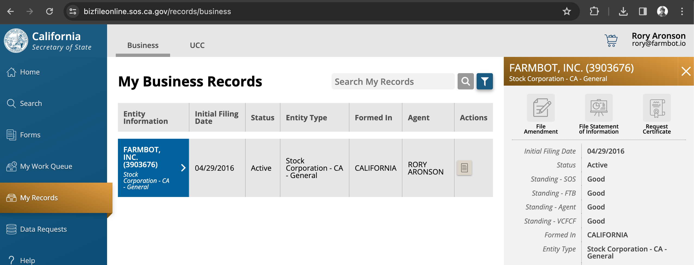

Once per year, a **Statement of Information** must be filed with the California Secretary of State for both FarmBot Inc and OpenFarm Inc. The state will send a **Reminder Notice Postcard** in the mail or email when it is time to file. When the postcard is received, complete the filing using the instructions below.

# Step 1: Go to the website

Navigate to the website indicated on the postcard; most recently: [bizfileonline.sos.ca.gov](https://bizfileonline.sos.ca.gov). Select **My Records** from the left menu, then select the entity to file for.

# Step 2: Fill out the form

From the panel on the right, select **File Statement of Information** and fill out the form fields.

- Rory Aronson is the registered agent.
- Rory Aronson is the acting board member.

Pay for the filing using a debit card.

# Step 3: Archive records

Save the filing confirmation as a PDF named `2024 [OpenFarm or FarmBot] Statement of Information` and upload to the **[OpenFarm or FarmBot] > Corporate > Statement of Information** folder in Google Drive.
