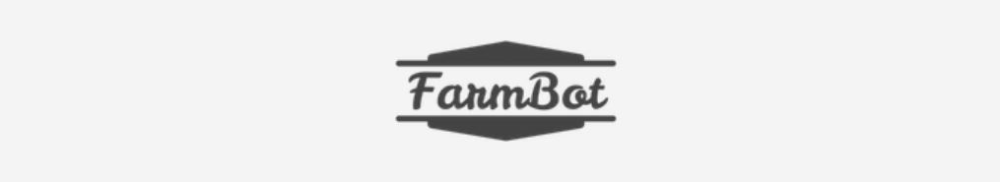
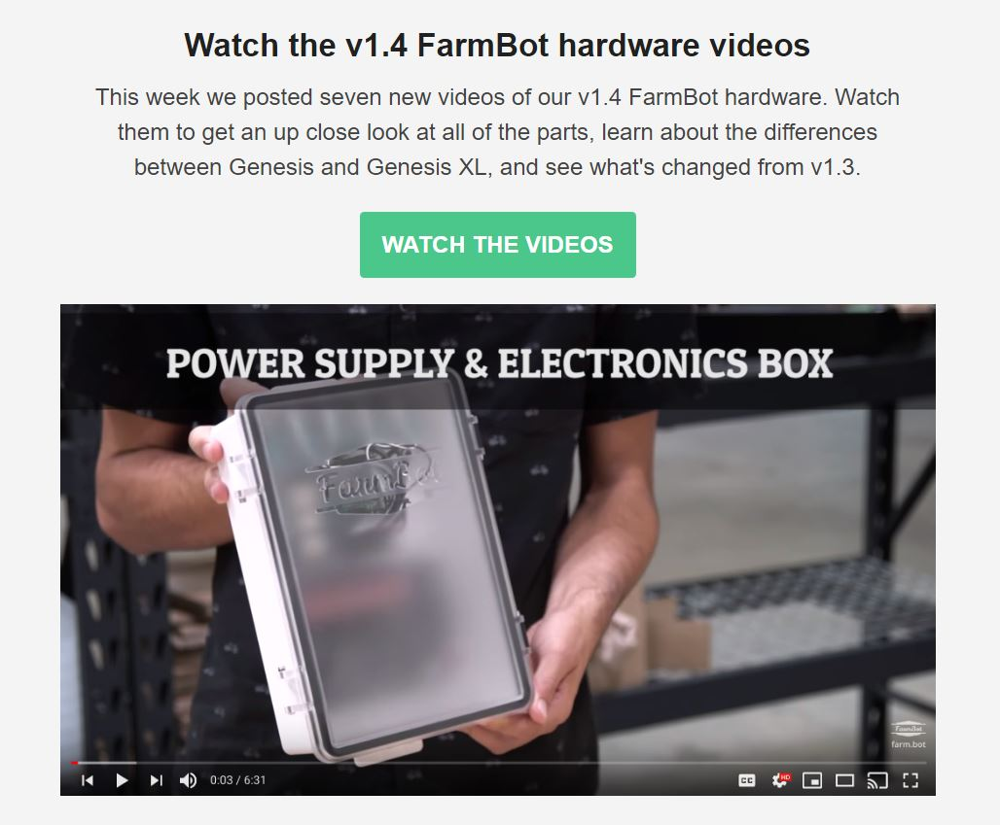
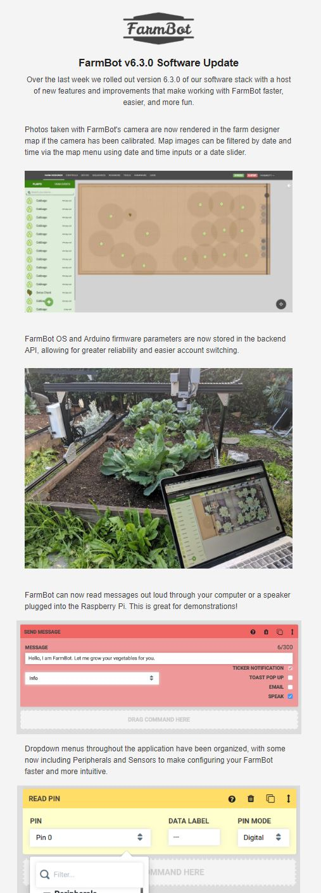
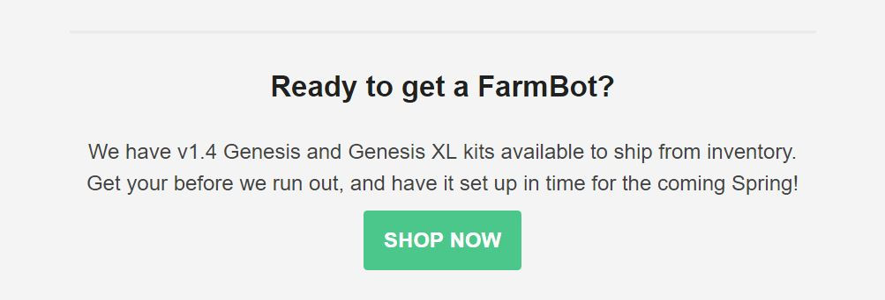
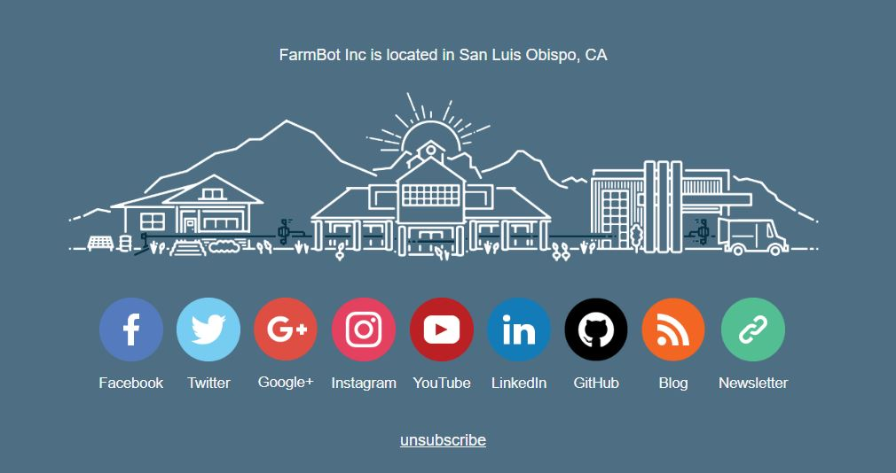

When someone signs up for our email newsletter, we add them to an automated multi-part welcome series of emails using Shopify Flow and Shopify Email. The series includes about 15 emails sent over approximately 6 weeks.

We use Shopify Email to send the following types of email newsletters:

  * News and promotions to **all email addresses** that have opted-in to email marketing from us either via checkout or a newsletter signup form.
  * News relevant to only **paying customers**. (this list is *rarely* used)
  * News relevant only to people who have purchased or pre-ordered a specific product.
  * Developer-specific news to our **FarmBot developers** list.

# Where people subscribe

Interested people can subscribe to our newsletter from the following places:

  * Every page on our website includes a popup form that will trigger after 2 minutes of being on the site.
  * The [Signup for our Newsletter](https://farm.bot/pages/newsletter) link in the main nav of our website.
  * In the Intercom messenger.
  * By opting-in to email marketing when placing an order.



# Newsletter style guide

Emails sent to the FarmBot newsletter list should provide real value to the subscriber by either disseminating new information (product release, software update, etc) or by offering a promotion. Emails sent to this list should be of general interest, written for lay-people, and not get too specific with details. They should be to-the-point, easily consumed, and have clear calls to action to *read more* or *buy a product*, etc.

## Subject line

An email newsletter should have one topic of focus, which should be communicated in the subject line. Subject lines should be informative and straight-forward. Often, it will make sense to have the subject line be very similar to the first heading in the email's body.



## Header

Every newsletter should include our standard header with our logo. The logo should link to our homepage.

## Body

An email newsletter should have one topic. Frequently, the single topic can be communicated concisely with the following pattern: one header, one to three short blocks of text, one call-to-action button, and a media element.

Sometimes the topic requires a little more content. The example below shows an initial header and blocks of text, followed by alternating media elements and brief text blocks that explain the media. All content maintains focus on the single topic.



## The pitch

The exception to the single-topic rule above is that almost all newsletters should include a short pitch and call-to-action to buy a FarmBot. The pitch should be after the main body and separated with a subtle dividing line.



## Footer

Every newsletter should include our standard email footer.


