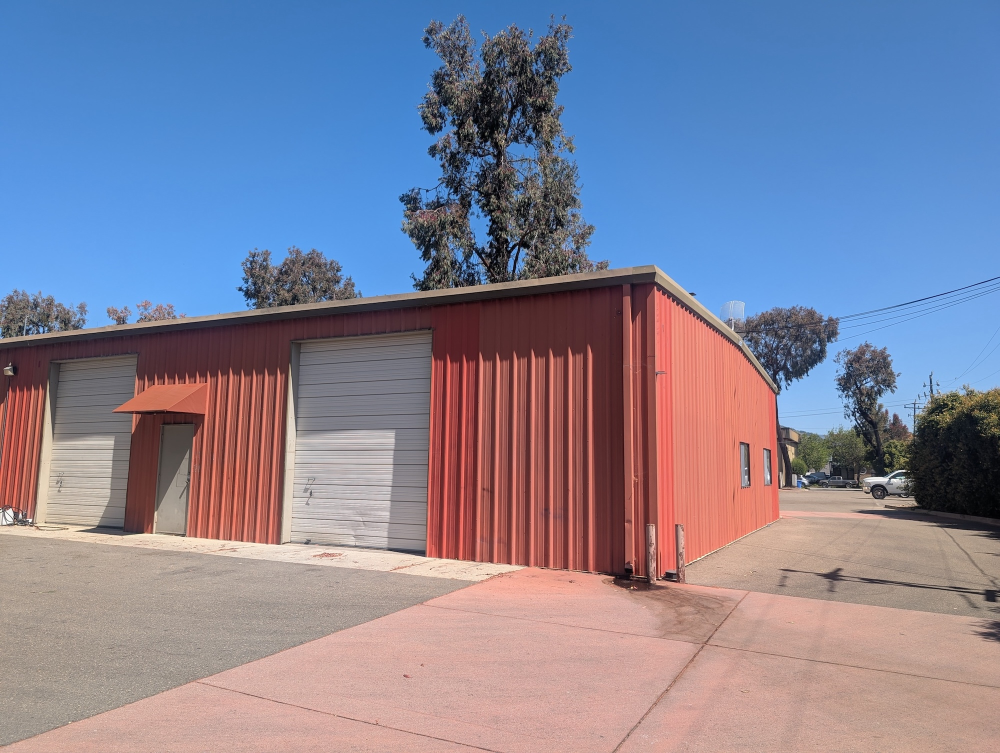

The **FarmBot warehouse** is where we store and ship all FarmBot kits and individual parts from. The lease in our current facility began on May 1st, 2025.

# Capacity

The current configuration of the warehouse has capacity to store 16 pallets in racks and at most 24 additional pallets on the floor.

|FarmBot          |Max # of Kits|
|-----------------|-------------|
|Genesis v1.8     |480          |
|Genesis XL v1.8  |480          |

# Rent history

|Facility         |Dates                      |Rent         |Notes                      |
|-----------------|---------------------------|-------------|---------------------------|
|Ricardo Court    |July 2018 - February 2020  |$4,550/month |                           |
|Ricardo Court    |March 2020 - April 2020    |$1,450/month |Covid relief               |
|Ricardo Court    |May 2020                   |$4,190       |Maintenance reconciliation |
|Ricardo Court    |May 2020 - July 2020       |$4,650/month |                           |
|Ricardo Court    |August 2020 - October 2020 |$0/month     |Covid relief               |
|Ricardo Court    |November 2020 - June 2021  |$4,750/month |                           |
|Ricardo Court    |June 2021                  |$3,059       |Maintenance reconciliation |
|Ricardo Court    |July 2021 - May 2022       |$4,850/month |                           |
|Ricardo Court    |May 2022                   |$1,481       |Maintenance reconciliation |
|Ricardo Court    |June 2022 - May 2023       |$4,950/month |                           |
|Ricardo Court    |May 2023                   |$2,576       |Maintenance reconciliation |
|Ricardo Court    |June 2023 - May 2024       |$5,050/month |                           |
|Ricardo Court    |May 2024                   |$3,913       |Maintenance reconciliation |
|Ricardo Court    |June 2024 - July 2024      |$5,175/month |                           |
|Ricardo Court    |August 2024 - May 2025     |$5,325/month |                           |
|Ricardo Court    |May 2025                   |$1,146       |Maintenance reconciliation |
|Current Facility |May 2025                   |$3,000       |Security deposit           |
|Current Facility |May 2025 - Present         |$3,000/month |                           |

# What's next?

 * [Inventory](warehouse/inventory.md)
 * [Shipping](warehouse/shipping.md)
 * [Warehouse Supplies and Equipment](warehouse/warehouse-supplies-and-equipment.md)
